# Dispatcher

A Qt-based ROS 2 widget for starting, stopping, and monitoring both ROS nodes and arbitrary shell processes.

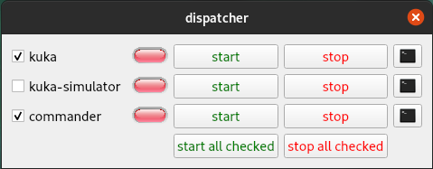

`dispatcher` builds its UI from a YAML file. Each configured item is launched in its own detached tmux session, and the terminal button can attach a `gnome-terminal` window to that session when available.

## Runtime Parameters

The `dispatcher` executable uses the following ROS parameters:

| Name | Type | Default | Description |
| --- | --- | --- | --- |
| `dispatcher_config_path` | `string` | `""` | Path to the dispatcher YAML file. |
| `initial_configuration` | `string` | `""` | Configuration name to select on startup. |
| `start_checked_on_startup` | `bool` | `false` | Start all checked process items after loading the initial configuration. |
| `ssh_timeout_sec` | `int` | `10` | Timeout used when building remote SSH commands. |
| `target_loop_rate_hz` | `double` | `100.0` | Main process/status polling rate. |

## YAML Configuration

The top-level dispatcher YAML supports:

| Key | Required | Description |
| --- | --- | --- |
| `workspace` | Yes | Workspace path used by ROS process items before sourcing `install/setup.bash`. |
| `nodes` | Yes | Process and category definitions rendered in the main panel. |
| `configurations` | No | Named runtime configurations. Each entry may be a simple name or a map with `name`, `cmd_prefix`, `environment_variables`, and `icon`. |
| `cmd_prefix` | No | Default command prefix for the implicit `all` configuration. |
| `environment_variables` | No | Default environment variables for the implicit `all` configuration. |
| `hide_unconfigured_processes` | No | If true, items missing in the active configuration are hidden instead of disabled. |
| `scripts` | No | Script button definitions shown in the scripts panel. |
| `variables` | No | Variable selectors used for `$VARIABLE` command substitution. |

### Node Types

Each entry in `nodes` can be:

- A ROS process item. If `type` is omitted, the item is treated as ROS by default.
- A shell process item with `type: shell`.
- A collapsible category with `type: category` and an `items` array. Entries in
  `items` follow the same rules, including the default to ROS when `type` is
  omitted.

Common item fields include:

| Key | Description |
| --- | --- |
| `name` | UI label and tmux-session base name. |
| `cmd` | Command used for the implicit `all` configuration. |
| `configurations` | Per-configuration command definitions. |
| `start_checked` | Whether the item starts checked in the UI. Optional, defaults to `false`. |
| `stop_tmux_cmd` | Stop sequence sent to tmux. Optional, defaults to `C-C`. |
| `hostname` / `user` | Optional remote execution target for local commands or configuration entries. |
| `use_cmd_prefix` | Enables or disables command-prefix injection. |
| `use_environment_variables` | Enables or disables environment-variable injection. |
| `attach_on_start` | Opens a terminal automatically after launch. |

ROS process items can additionally define `node_name` plus an optional
`namespace`, or a `ros_nodes` array with the same monitoring fields for
online-state monitoring. An omitted `namespace` resolves to the root namespace,
so `name: talker` matches the graph's `/talker`; a `name` that is already
absolute, such as `/fcat/fcat`, carries its own namespace.

Shell process items use `pgrep` on the item name to infer online state.

### Scripts and Variables

Script entries support:

| Key | Description |
| --- | --- |
| `name` | Button label. |
| `cmd` or `configurations` | Script command definition. |
| `row`, `column` | Grid placement in the scripts panel. |
| `icon` | Optional Qt resource path for the button icon. |
| `use_terminal` | Whether to wrap execution in `gnome-terminal --`. |

Variable entries support:

| Key | Description |
| --- | --- |
| `name` | Variable name used in commands, for example `$FCAT_LOOP_RATE_HZ`. |
| `choices` | Selectable values exposed in the UI. |

## Examples

The following examples build incrementally from a minimal configuration to a
full-featured setup. Each one corresponds to a YAML file in [`config/`](config/)
and a screenshot in [`doc/`](doc/).

### ROS 2 Demos (runnable out of the box)

Four examples run without any custom packages, using only the demos that ship
with ROS 2. Each is self-contained and includes an `rqt_graph` button. Install
the demo packages if needed:

```bash
sudo apt install ros-$ROS_DISTRO-demo-nodes-cpp \
                 ros-$ROS_DISTRO-demo-nodes-py \
                 ros-$ROS_DISTRO-turtlesim \
                 ros-$ROS_DISTRO-rqt-graph
```

Launch any of them from the root of the colcon workspace containing
`dispatcher`:

```bash
source install/setup.bash
ros2 run dispatcher dispatcher --ros-args \
  -p dispatcher_config_path:=src/dispatcher/config/<example>.yaml \
  -p start_checked_on_startup:=true
```

#### Talker / Listener

[`config/example_ros2_talker_listener.yaml`](config/example_ros2_talker_listener.yaml)
is the publisher/subscriber "hello world" plus topic introspection scripts. The
`cpp` and `python` configurations swap between `demo_nodes_cpp` and
`demo_nodes_py`, and a `LOG_LEVEL` variable is substituted into every command.
Launch it with `-p initial_configuration:=cpp`.

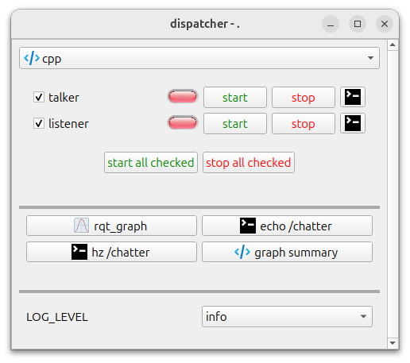

#### Namespaces And Categories

[`config/example_ros2_namespaces.yaml`](config/example_ros2_namespaces.yaml) runs
two talker/listener pairs remapped into `/demo1` and `/demo2` with `-r __ns:=`,
each grouped in a collapsible `type: category` — `/demo1` is expanded and
`/demo2` collapsed below. The `root_pair_launch_file` item shows a single entry
monitoring two nodes at once. This file defines no `configurations`, so the
selector at the top stays empty.

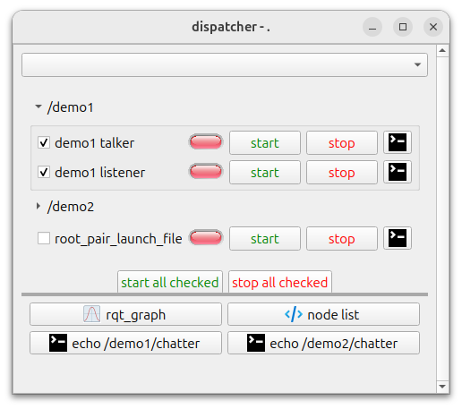

#### Services

[`config/example_ros2_services.yaml`](config/example_ros2_services.yaml) starts
`add_two_ints_server` under `cpp`/`python` configurations alongside a two-node
launch-file item, with script buttons that call the service and run the demo
clients. Launch it with `-p initial_configuration:=cpp`. Note the second item's
label elided to `introspec...unch_file`: item names longer than the checkbox
width are shortened in the middle.

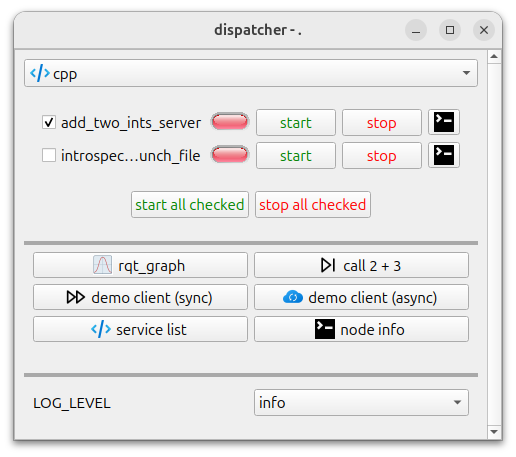

#### Turtlesim

[`config/example_ros2_turtlesim.yaml`](config/example_ros2_turtlesim.yaml) mixes
`type: shell` items whose status comes from `pgrep` (`turtlesim_node`, `teleop`)
with a ROS item monitored through the graph (`draw_square`). `teleop` sets
`attach_on_start` so it opens its own terminal for keystrokes, and the scripts
panel is filled with buttons that publish to topics and call services.

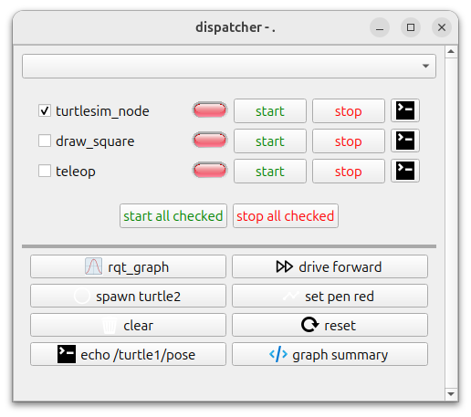

The talker/listener example is the smallest starting point:

```yaml
workspace: .

variables:
  - name: LOG_LEVEL
    choices:
    - info
    - debug
    - warn

configurations:
  - name: cpp
    icon: :/icons/source_code.png
  - name: python
    icon: :/icons/application.png

nodes:
  - name: talker
    ros_nodes:
    - namespace: /
      name: talker
    configurations:
    - name: cpp
      cmd: ros2 run demo_nodes_cpp talker --ros-args --log-level $LOG_LEVEL
    - name: python
      cmd: ros2 run demo_nodes_py talker --ros-args --log-level $LOG_LEVEL
    start_checked: true

  - name: listener
    ros_nodes:
    - namespace: /
      name: listener
    configurations:
    - name: cpp
      cmd: ros2 run demo_nodes_cpp listener --ros-args --log-level $LOG_LEVEL
    - name: python
      cmd: ros2 run demo_nodes_py listener --ros-args --log-level $LOG_LEVEL
    start_checked: true

scripts:
  - name: rqt_graph
    cmd: ros2 run rqt_graph rqt_graph &
    icon: :/icons/plot.png
    row: 0
    column: 0
    use_terminal: false
```

Several details in those files are worth calling out because they are easy to
get wrong when writing a config from scratch:

- **A script with `use_terminal: false` must end in `&`.** Such a script runs as
  a blocking `system("bash -c <cmd>")` call on the Qt main thread, so without the
  `&` the entire dispatcher UI freezes until the command exits. Scripts with
  `use_terminal: true` are wrapped in `gnome-terminal --`, which returns
  immediately, so those do not need it.
- **Avoid script commands that can block forever.** `ros2 topic pub --once` waits
  indefinitely for a matching subscriber and `ros2 service call` waits
  indefinitely for the service, so pressing such a button while the target node
  is stopped leaves a process spinning. Bound them with
  `--max-wait-time-secs N` or `timeout N`.
- **A non-root `namespace` must be spelled out.** Status matching compares
  against the fully-qualified name from the ROS graph, so a node remapped with
  `-r __ns:=/demo` has to be monitored as `namespace: /demo`. An omitted
  `namespace` resolves to the root namespace, and a `name` that is already
  absolute (`name: /fcat/fcat`) carries its own.
- **Do not monitor the same node from two items.** Both items turn green when
  either one is started, which makes the status lights meaningless. Give each
  item a distinct set of `ros_nodes`.
- **Launch a multi-node item with a launch file, not `cmd_a & cmd_b`.** The stop
  button sends `C-C` to the tmux session, which only reaches the foreground
  process and leaves the backgrounded node orphaned.
- **Commands cannot contain single quotes.** Process commands are sent as
  `tmux send-keys -t <session> '<cmd>' Enter` and scripts are run as
  `bash -c '<cmd>'`, so a literal `'` closes the wrapper. Use double quotes
  instead, and wrap the whole YAML value in single quotes when the command
  contains `': '` (as in `ros2 service call ... "{a: 2, b: 3}"`), which YAML
  would otherwise read as a nested mapping.
- **Keep shell metacharacters out of process item names.** A process item's name
  becomes its tmux session name and is interpolated unquoted into commands like
  `tmux has-session -t <index>_<name>`. Only spaces are sanitized (to
  underscores), so a name like `root pair (launch file)` makes every tmux call
  for that item fail with `sh: Syntax error: "(" unexpected`. Script names are
  not affected.
- **A `type: shell` item's name must match the process it starts.** Status comes
  from `pgrep <name>`, which matches against the kernel's 15-character `comm`
  field. Naming an item `turtle_teleop_key` fails — `pgrep` refuses patterns
  longer than 15 characters — while `teleop` matches the truncated
  `turtle_teleop_k` as a substring.
- **Beware YAML booleans in service request fields.** `ros2 service call` parses
  its request with YAML 1.1, which reads bare `off`, `on`, `yes`, and `no` as
  booleans. `"{r: 255, g: 0, b: 0, width: 5, off: 0}"` fails with `attribute
  name must be string, not 'bool'`; omit the field or quote the key.

### Recovering From A Killed Dispatcher

Dispatcher cleans up after itself on a normal quit or `SIGINT`/`SIGTERM`: it
stops each item, kills the tmux sessions, and removes `/tmp/dispatcher.lock`. If
the process is `SIGKILL`ed instead, none of that runs, which leaves behind:

- **A stale lock file.** The next launch aborts with `Could not get lock on file
  /tmp/dispatcher.lock; an instance of Dispatcher appears to already be
  running`. Remove it with `rm /tmp/dispatcher.lock`.
- **Orphaned tmux sessions still running your nodes.** Inspect with `tmux ls`
  and clear them with `tmux kill-server` (or `tmux kill-session -t <name>` to be
  selective).

### Configurations

[`config/example_configurations.yaml`](config/example_configurations.yaml)
shows the simplest multi-configuration setup. Two named configurations
(`config_A` and `config_B`) control which processes are available and which
commands they run. Processes that lack a definition for the active configuration
are grayed out.

| config_A | config_B |
| --- | --- |
| 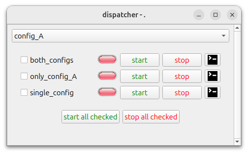 | 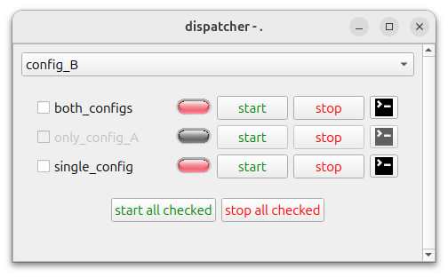 |

```yaml
configurations:
  - config_A
  - config_B

nodes:
  - name: both_configs
    configurations:
      - name: config_A
        cmd: echo "Running config_A"
      - name: config_B
        cmd: echo "Running config_B"
  - name: only_config_A
    configurations:
      - name: config_A
        cmd: echo "Only running config_A"
  - name: single_config
    cmd: echo "Running single_config"
```

### Scripts

[`config/example_scripts.yaml`](config/example_scripts.yaml) adds a **scripts
panel** with one-click action buttons placed in a grid. Each button can
optionally display an icon and choose whether to open in a terminal.

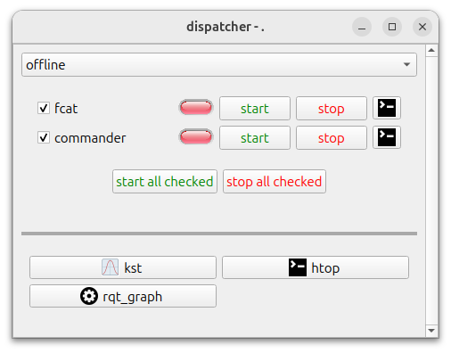

```yaml
scripts:
  - name: kst
    cmd: kst2 &
    icon: :/icons/plot.png
    row: 0
    column: 0
    use_terminal: false

  - name: htop
    cmd: htop
    icon: :/icons/terminal.png
    row: 0
    column: 1
    use_terminal: true

  - name: rqt_graph
    cmd: ros2 run rqt_graph rqt_graph &
    row: 1
    column: 0
    use_terminal: false
```

### Variables

[`config/example_variables.yaml`](config/example_variables.yaml) introduces
**variable selectors** shown as drop-downs in the UI. References like
`$FCAT_LOOP_RATE_HZ` in any command are substituted with the selected value
at launch time.

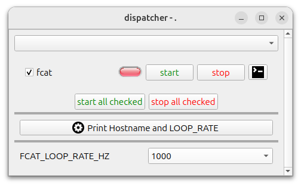

```yaml
variables:
  - name: FCAT_LOOP_RATE_HZ
    choices:
    - 1000
    - 500
    - 250
    - 100

nodes:
  - name: fcat
    ros_nodes:
    - name: /fcat/fcat
    cmd: ros2 launch robot_bringup fcat_offline.py --rate $FCAT_LOOP_RATE_HZ
    start_checked: true

scripts:
  - name: "Print Hostname and LOOP_RATE"
    cmd: cat /etc/hostname && echo Loop rate $FCAT_LOOP_RATE_HZ
    row: 0
    column: 0
    use_terminal: false
```

### Shell Processes

[`config/example_shell.yaml`](config/example_shell.yaml) combines several
features: `type: shell` processes that use `pgrep` for status,
`hide_unconfigured_processes: true` to hide (rather than gray out) items
without a command for the active configuration, and configuration entries with
custom icons.

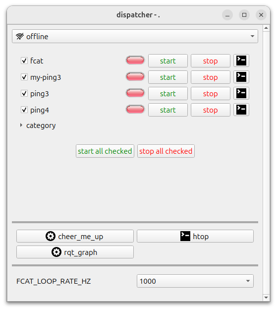

```yaml
hide_unconfigured_processes: true

configurations:
  - name: online
    icon: :/icons/wifi.png
  - name: offline
    icon: :/icons/wifi-no.png

nodes:
  - name: fcat
    ros_nodes:
    - namespace: /fcat
      name: fcat
    configurations:
    - name: online
      cmd: ros2 launch ... --rate $FCAT_LOOP_RATE_HZ
    - name: offline
      cmd: ros2 launch ... --rate $FCAT_LOOP_RATE_HZ
    start_checked: true

  - name: my-ping3
    type: shell
    configurations:
    - name: online
      cmd: ping asimov-dev
    - name: offline
      cmd: ping asimov-dev
    start_checked: true
```

### Categories

[`config/example_category.yaml`](config/example_category.yaml) groups
processes into collapsible categories using `type: category`. Each category
can hold any mix of ROS and shell items and can be expanded or collapsed in
the UI.

| collapsed | expanded |
| --- | --- |
| 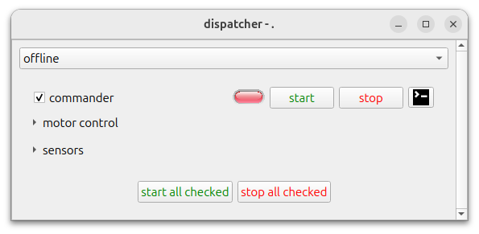 | 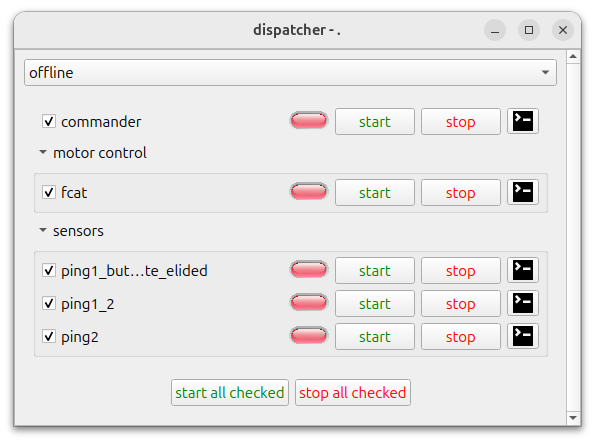 |

```yaml
nodes:
  - name: commander
    namespace: /commander
    node_name: commander
    cmd: ros2 run commander commander
    start_checked: true

  - name: motor control
    type: category
    items:
    - name: fcat
      type: ros
      ros_nodes:
      - namespace: /fcat
        name: fcat
      configurations:
      - name: online
        cmd: ros2 launch ... fcat_online.py
      - name: offline
        cmd: ros2 launch ... fcat_offline.py
      start_checked: true

  - name: sensors
    type: category
    items:
    - name: ping1_but_this_is_a_very_long_name_to_demonstrate_elided
      type: shell
      configurations:
      - name: online
        cmd: ping google.com
      - name: offline
        cmd: ping asimov-dev
      start_checked: true
```

Categories can similarly be used to group the buttons generated with the `scripts` key. This allows the used to cluster buttons, and to toggle their visibility by collapsing them. As with nodes, the syntax is to use `type: category` in the script item YAML definition.

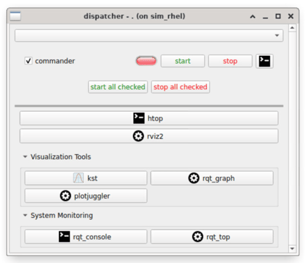

```yaml
workspace: .

nodes:
  - name: commander
    namespace: /commander
    node_name: commander
    cmd: ros2 run commander commander
    start_checked: true

scripts:

  # Regular uncategorized scripts
  - name: htop
    cmd: htop
    icon: :/icons/terminal.png
    row: 0
    column: 0
    use_terminal: true

  # Categorized visualization tools
  - name: Visualization Tools
    type: category
    items:
    - name: kst
      cmd: kst2 &
      icon: :/icons/plot.png
      row: 0
      column: 0
      use_terminal: false

    - name: rqt_graph
      cmd: ros2 run rqt_graph rqt_graph &
      row: 0
      column: 1
      use_terminal: false

    - name: plotjuggler
      cmd: ros2 run plotjuggler plotjuggler &
      row: 1  
      column: 0
      use_terminal: false

  # Categorized monitoring tools
  - name: System Monitoring
    type: category
    items:
    - name: rqt_console
      cmd: ros2 run rqt_console rqt_console &
      icon: :/icons/terminal.png
      row: 0
      column: 0
      use_terminal: false

    - name: rqt_top
      cmd: ros2 run rqt_top rqt_top &
      row: 0
      column: 1
      use_terminal: false

  # Another regular script after categories
  - name: rviz2
    cmd: ros2 run rviz2 rviz2 &
    row: 1
    column: 0
    use_terminal: false
```

### Remote Sessions

[`config/example_remote_session.yaml`](config/example_remote_session.yaml)
demonstrates running commands on a remote host over SSH. Adding `hostname`
(and optionally `user`) to a process or script causes the dispatcher to wrap
the command in `ssh hostname "command"`. Per-configuration environment
variables are also shown.

```yaml
configurations:
  - name: online
    environment_variables:
      RMW_IMPLEMENTATION: rmw_cyclonedds_cpp
      CYCLONEDDS_URI: /etc/cyclonedds_online.xml
  - name: offline
    environment_variables:
      RMW_IMPLEMENTATION: rmw_cyclonedds_cpp
      CYCLONEDDS_URI: /etc/cyclonedds_offline.xml

nodes:
  - name: fcat
    configurations:
    - name: online
      cmd: ros2 launch ... fcat_online.py
      hostname: asimov-dev.jpl.nasa.gov
    - name: offline
      cmd: ros2 launch ... fcat_offline.py
    start_checked: true
```

## Running

From this package directory after building:

```bash
source /opt/ros/jazzy/setup.bash
source install/setup.bash
ros2 run dispatcher dispatcher --ros-args \
  -p dispatcher_config_path:=/path/to/dispatcher/config.yaml \
  -p initial_configuration:=offline \
  -p start_checked_on_startup:=true
```

If `initial_configuration` is omitted, the first configured entry is used. The
`start_checked_on_startup` parameter defaults to `false`; when enabled,
dispatcher starts each available item whose YAML `start_checked` value is
`true` after applying that initial configuration.

The terminal button opens a command like:

```bash
gnome-terminal -t commander -- tmux a -t 3_commander
```

You can attach manually from any terminal. First, you can list them with

```bash
tmux ls
```
For example, for `example_category.yaml` config:
```bash
$ tmux ls
1_commander: 1 windows (created Tue Mar 31 13:00:05 2026)
1_fcat: 1 windows (created Tue Mar 31 13:00:05 2026)
1_ping1_but_this_is_a_very_long_name_to_demonstrate_elided: 1 windows (created Tue Mar 31 13:00:05 2026)
2_ping1_2: 1 windows (created Tue Mar 31 13:00:05 2026)
3_ping2: 1 windows (created Tue Mar 31 13:00:05 2026)
```

Then, attach to the desired session with:

```bash
tmux a -t 1_fcat
```

## Build And Test

Install the dependencies using rosdep:

```bash
rosdep install --from-paths src --ignore-src -r -y
```

Build `dispatcher`. From this package directory, run:

```bash
source /opt/ros/jazzy/setup.bash
colcon build --base-paths . --packages-select dispatcher \
  --cmake-args -DCMAKE_BUILD_TYPE=RelWithDebInfo -DBUILD_TESTING=ON
```

Run the gtest suite with:

```bash
source /opt/ros/jazzy/setup.bash
colcon test --base-paths . --packages-select dispatcher
```

To print the collected test results:

```bash
colcon test-result --verbose
```

## License

This project is licensed under the Apache License, Version 2.0. See the [LICENSE](LICENSE) file for details.
